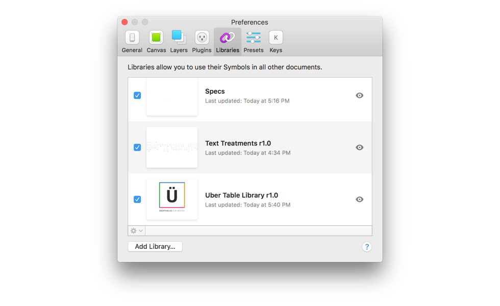

 

# Über Tables for Sketch

 

1. [Installation](#installation)
1. [Features](#features)
1. [Usage](#usage)
1. [FAQ](#faq)

## Installation
This file will only work in Sketch. 
* Open sketch preferences and click on "Libraries"
[]

## Features
* Feature 1

## Usage
1. Usage 1

## FAQ
#### — FAQ Question?
FAQ Answer
